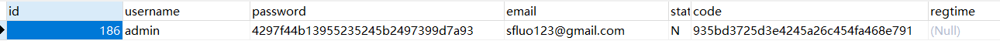

# 初探 Shiro 安全框架
## 技术栈：
- Shiro
- Spring Boot
- Mybatis
- Redis
## 实现的功能
- 用户认证
- 角色和权限授权（未连接数据库，案例中仅提供了静态数据用于测试）
- 密码加密
- 记住我
- Redis缓存用户认证和授权的信息，减少对关系数据库的直接访问
- 就这些了。。。
## 项目结构：
```text
│  pom.xml
│
└─src
    ├─main
    │  ├─java
    │  │  └─com
    │  │      └─example
    │  │          │  DemoApplication.java
    │  │          │
    │  │          ├─cache
    │  │          │      RedisCache.java
    │  │          │      RedisCacheManager.java
    │  │          │
    │  │          ├─controller
    │  │          │      UserController.java
    │  │          │
    │  │          ├─dao
    │  │          │      UserDao.java
    │  │          │
    │  │          ├─pojo
    │  │          │      User.java
    │  │          │
    │  │          ├─realm
    │  │          │      CustomRealm.java
    │  │          │
    │  │          ├─service
    │  │          │      UserService.java
    │  │          │      UserServiceImpl.java
    │  │          │
    │  │          └─shiro
    │  │                  ShiroConfig.java
    │  │
    │  └─resources
    │          application.properties
    │          users.ini
    │
    └─test
        └─java
            └─com
                └─example
                    └─demo
                            DemoApplicationTests.java
```
## 数据库表
